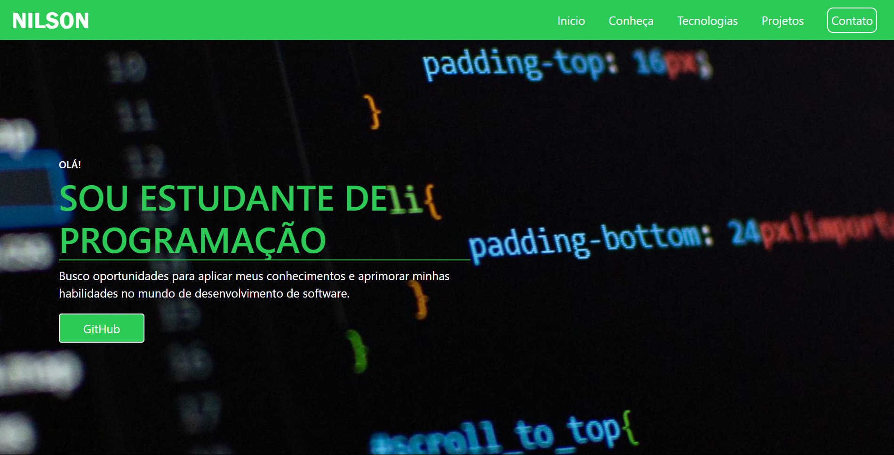
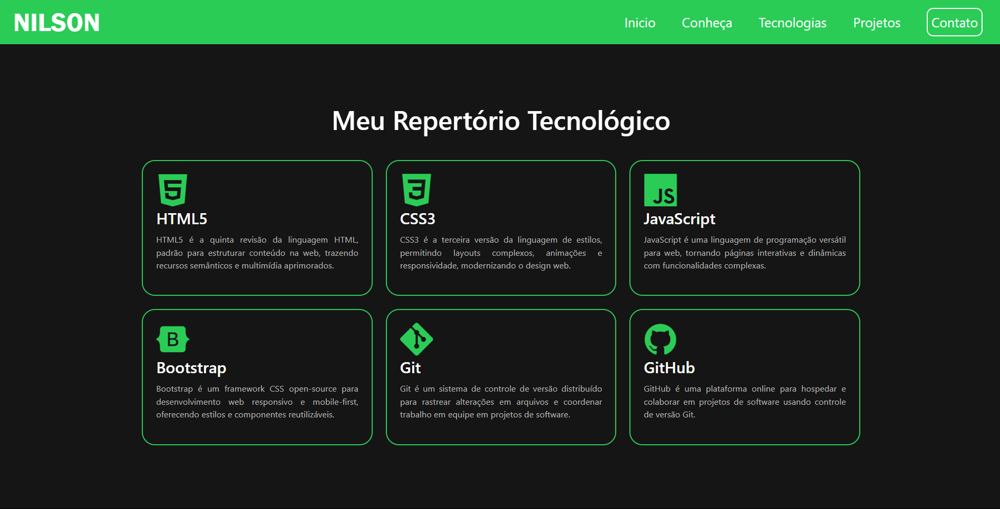
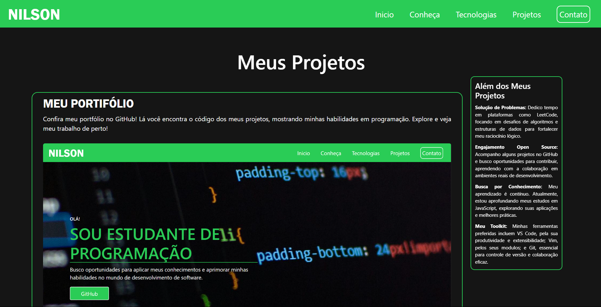
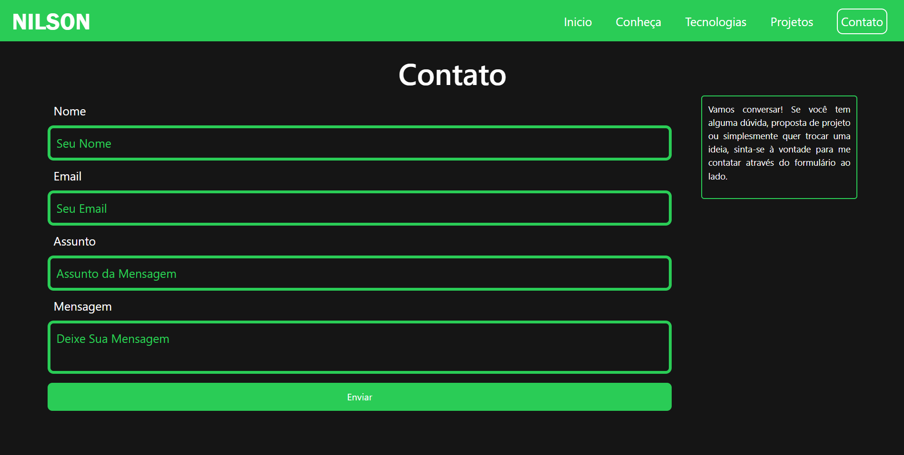

# Meu Portfólio

## Olá, bem vindo ao meu portifólio! 👋

Sou Josenilson, um estudante de programação de 17 anos em busca de oportunidades para aplicar e aprimorar minhas habilidades no dinâmico mundo do desenvolvimento de software. A paixão por transformar ideias em softwares funcionais me impulsiona, e a lógica da programação, juntamente com o impacto positivo da tecnologia, me fascinam profundamente.

Meu foco principal é o desenvolvimento web completo, onde almejo atuar em todas as camadas das aplicações. Além disso, possuo um grande interesse nas áreas de Inteligência Artificial e Análise de Dados, vislumbrando o potencial para solucionar problemas complexos e gerar insights valiosos.

## Conheça-me Melhor 🤓

Minha experiência prática é baseada nos cursos que tenho realizado, nos quais adquiri os fundamentos de tecnologias essenciais como **HTML**, **CSS** e **JavaScript**. Essas oportunidades me permitiram aplicar conceitos básicos e compreender o fluxo inicial de desenvolvimento. Valorizo imensamente o aprendizado obtido e estou ansioso para contribuir em projetos mais desafiadores e colaborativos.

Atualmente, dedico meus estudos ao aprofundamento em **JavaScript**, buscando uma base sólida para o meu crescimento como desenvolvedor. Acredito que com dedicação e aprendizado contínuo, expandirei minhas habilidades e me tornarei um profissional cada vez mais competente e capaz de agregar valor a projetos significativos.

## Meu Repertório Tecnológico 🛠️

* **HTML5:** A base para estruturar o conteúdo da web, com recursos semânticos e multimídia aprimorados.
* **CSS3:** A linguagem de estilos que permite criar layouts complexos, animações e garantir a responsividade do design web.
* **JavaScript:** Uma linguagem de programação versátil para tornar as páginas web interativas e dinâmicas.
* **Bootstrap:** Um framework CSS open-source que facilita o desenvolvimento web responsivo e mobile-first com componentes reutilizáveis.
* **Git:** Um sistema de controle de versão distribuído essencial para rastrear alterações e colaborar em projetos de software.
* **GitHub:** Uma plataforma online para hospedar, gerenciar e colaborar em projetos de software utilizando o Git.

## Meus Projetos 🚀

### Meu Portfólio

Confira o código deste portfólio no GitHub para ver minhas habilidades em ação! Explore a estrutura e o desenvolvimento por trás desta apresentação do meu trabalho.

[Acesse](https://github.com/Nilsonsousa16/Meu-Portif-lio)

### Far Club

Um site informativo dedicado à franquia de jogos Far Cry, com o objetivo de despertar a curiosidade e o interesse de novos jogadores nesse universo rico em histórias e temáticas diversas.

[Acesse](https://github.com/Nilsonsousa16/Far-Club/tree/main)

### Além dos Meus Projetos (Aprendizado Contínuo) 💡

* **Solução de Problemas:** Dedico tempo regularmente em plataformas como LeetCode para aprimorar minhas habilidades em algoritmos e estruturas de dados, fortalecendo meu raciocínio lógico.
* **Engajamento Open Source:** Acompanho ativamente projetos no GitHub e estou sempre à procura de oportunidades para contribuir e aprender em ambientes de desenvolvimento colaborativos.
* **Busca por Conhecimento:** Meu aprendizado é uma jornada constante. No momento, estou focando em aprofundar meus conhecimentos em JavaScript, explorando suas diversas aplicações e as melhores práticas da área.
* **Meu Toolkit:** As ferramentas que mais utilizo e aprecio são VS Code pela sua produtividade e extensibilidade, Vim pela sua eficiência via teclado, e Git como ferramenta fundamental para o controle de versão e colaboração.

## Contato 💬

Vamos conversar! Se você tiver alguma pergunta, proposta de projeto ou simplesmente quiser trocar ideias sobre tecnologia e desenvolvimento, sinta-se à vontade para entrar em contato. Você pode me enviar uma mensagem através do formulário de contato no meu portfólio.

Estou ansioso para conectar e explorar novas oportunidades!
